# app-album Figma Design Package

这是一套基于当前 `app-album` 已开发主体功能重绘的 Excalidraw 手绘风 Figma 设计稿。

本轮原则：

- 只表现当前代码里已经存在的页面、入口、菜单和配置项。
- 不加入内容搜索、内容筛选、安全评分、异常提醒、自动扫描等当前未落地能力。
- 保留 `手机互传` 当前已有的“搜索附近设备”功能。
- 会参考当前已经完成的主体功能与二级页面，而不是只画主入口。
- 示例目录名仍用中性占位，如 `目录 01`、`子目录 01`、`主目录`，避免捏造具体业务场景。
- 视觉改成 Excalidraw 式手绘风：淡纸色背景、双线手绘描边、低饱和填充、松弛留白。
- 主字体改为优先使用系统字体 `Hannotate TC`。
- 分类页里的 `新建目录 / 导入...` 已改为右上角菜单展开态表现，和现有代码一致。

## 文件

- `figma-design-spec.md`: 设计说明、页面映射、视觉规范
- `svg/*.svg`: 可直接拖入 Figma 的矢量稿
- `png/*.png`: 预览图
- `render-designs.mjs`: 生成 SVG 源文件的脚本

## 预览

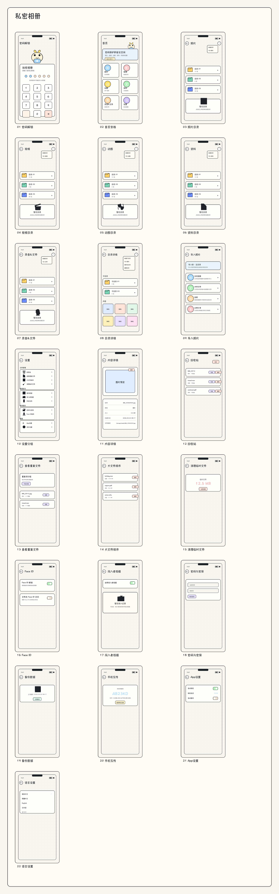

## 页面

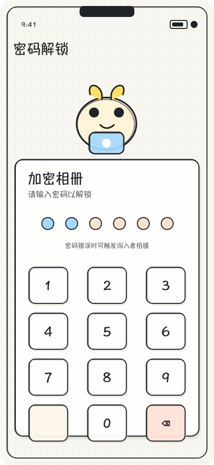

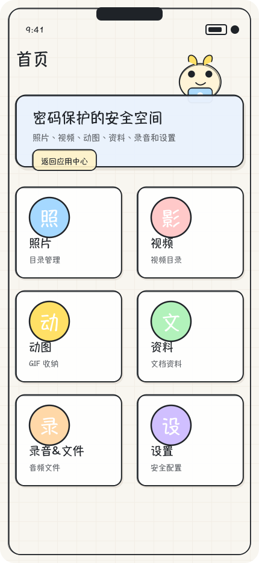

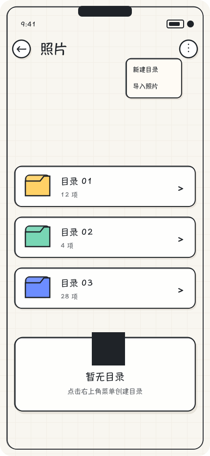

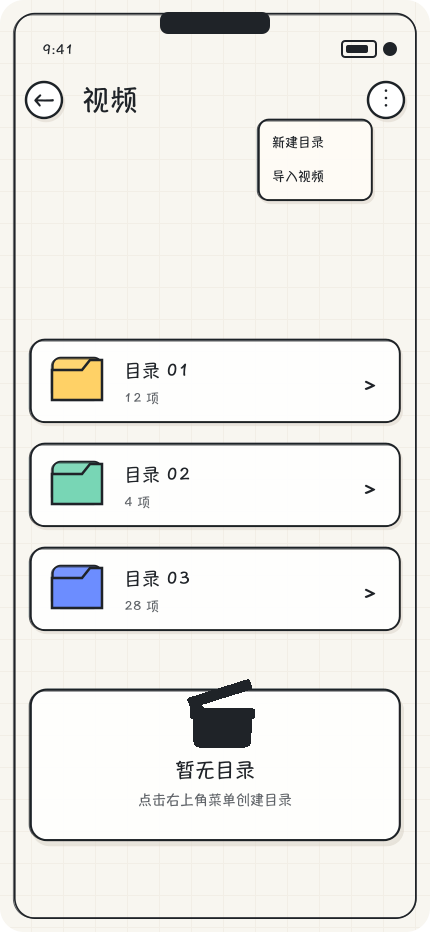

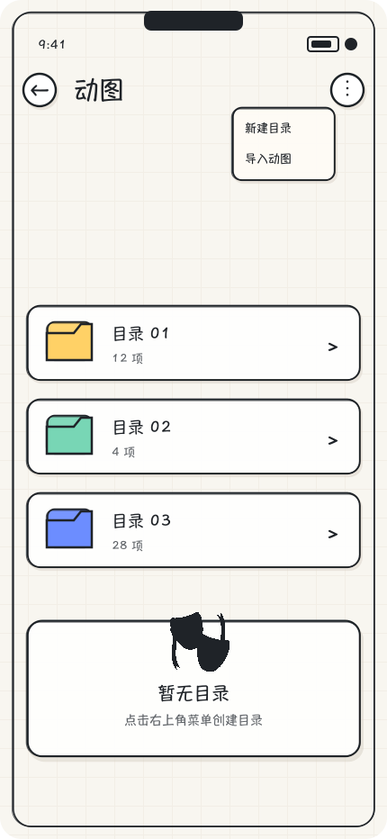

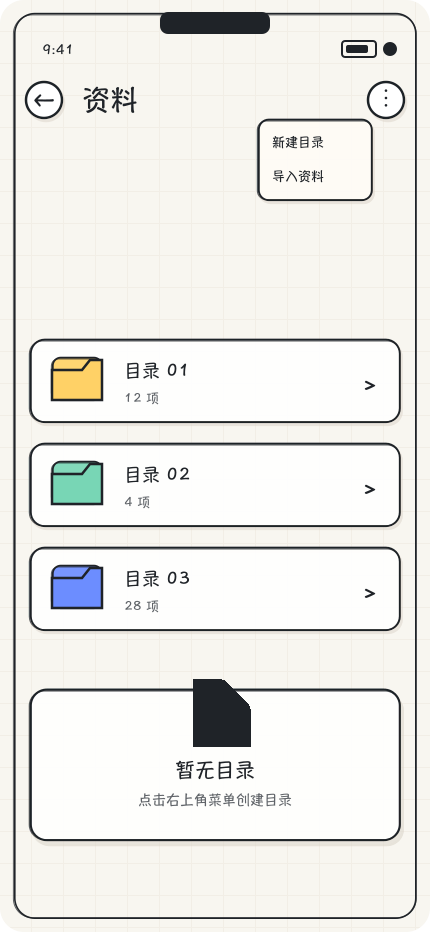

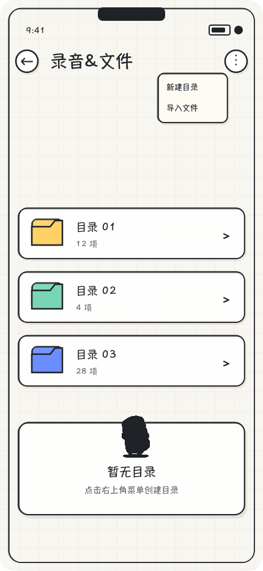

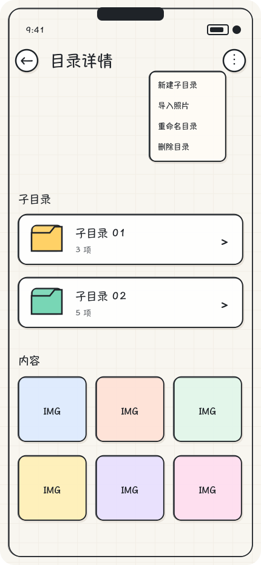

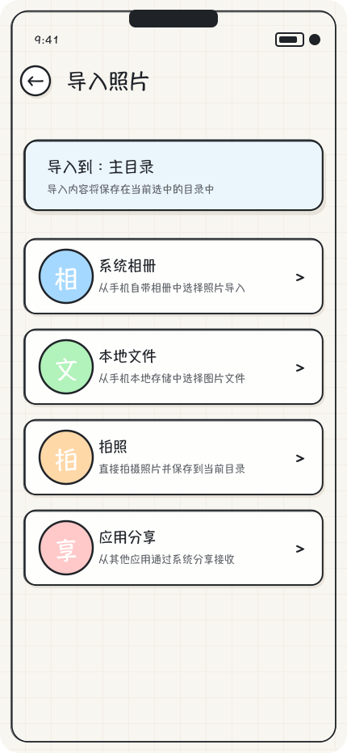

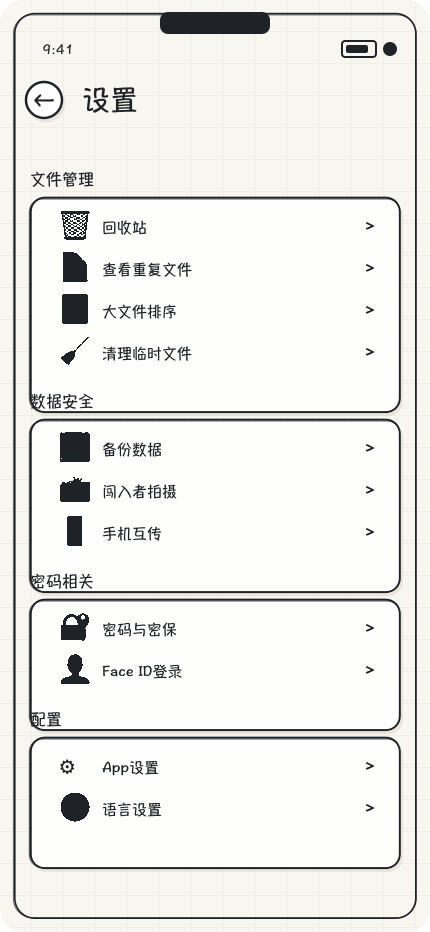

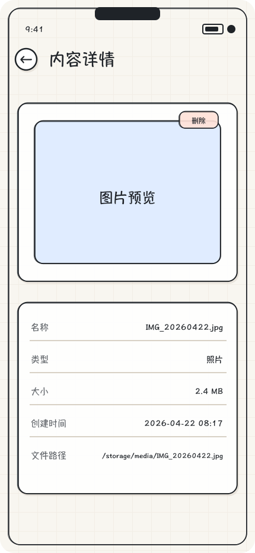

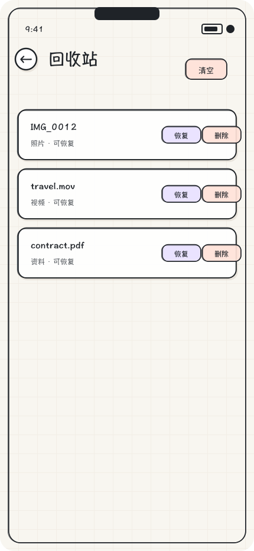

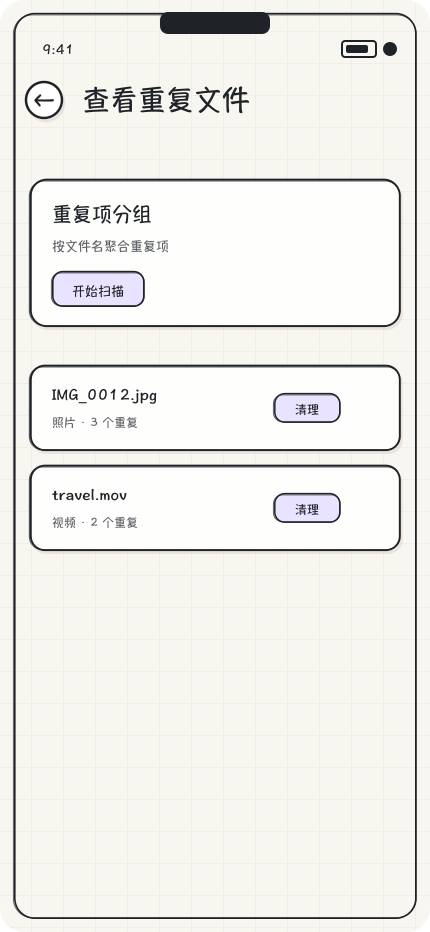

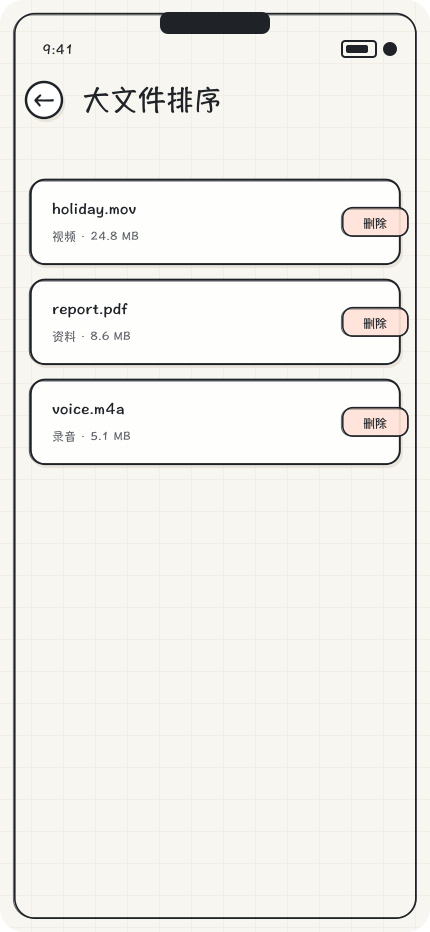

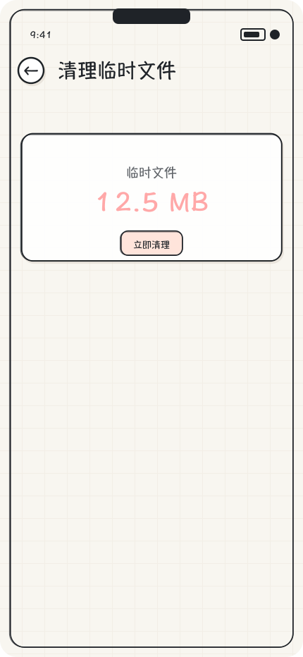

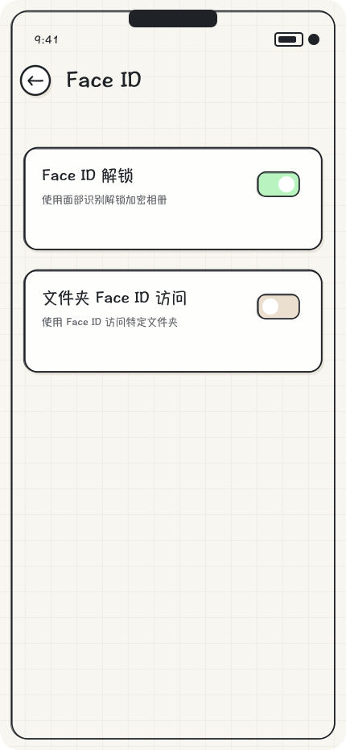

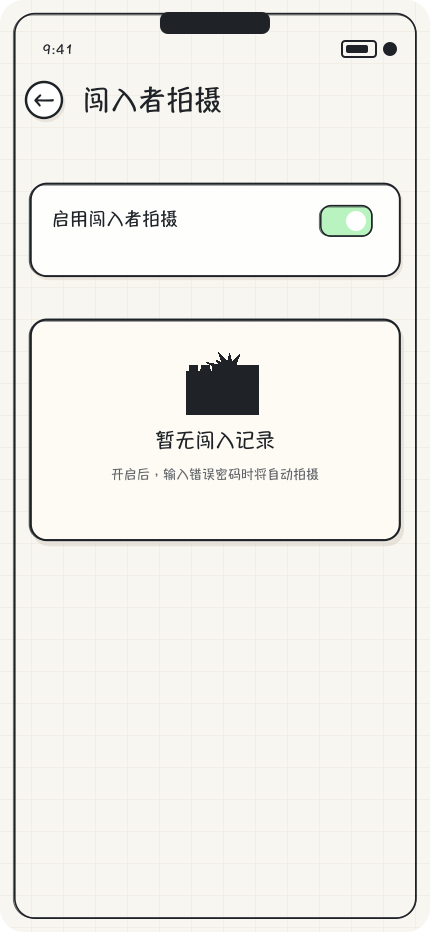

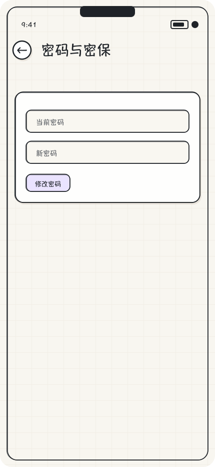

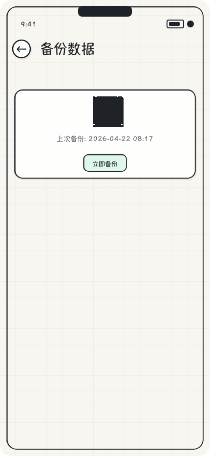

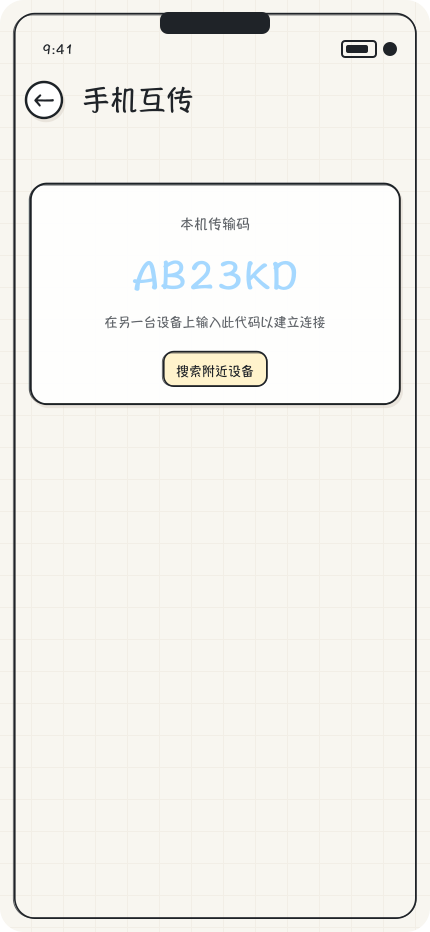

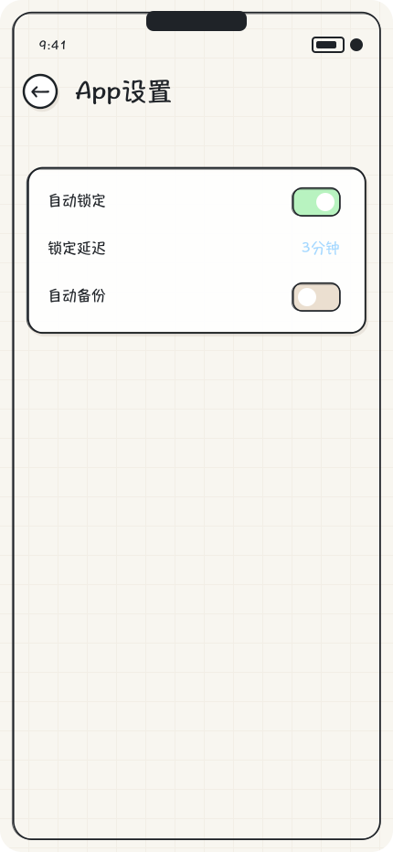

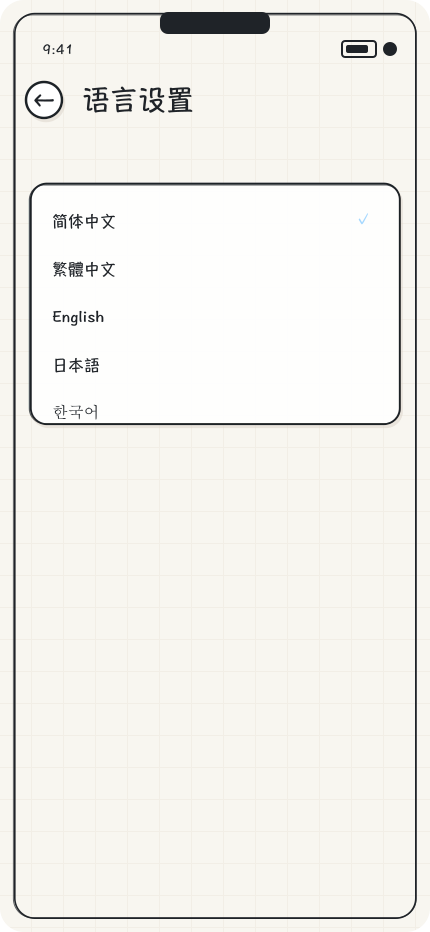

## 说明

这批图片是“设计稿截图”，不是 HarmonyOS 真机运行截图。当前环境没有连接设备，`hdc list targets` 返回 `[Empty]`，所以无法生成真实运行态截图。
